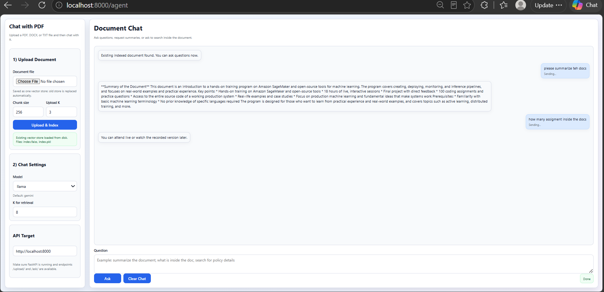

# Chat with Document (RAG system using Langchain)


This project is a FastAPI-based QA application that lets you upload a PDF/DOCX/TXT document, build a vector index, and ask questions about the document through a simple web UI.

## Features

- Upload a document and create a FAISS vector store
- Persist vector store on disk (`data/faiss_index/active`)
- Ask questions from the document via two models:
  - `gemini`
  - `llama`
- Sidebar settings for chunk size, `k` values, and model selection
- Auto-load existing vector store on page load if already present
- API-first backend with optional static frontend page

## Project structure

- `main.py`  
  FastAPI app and endpoints.
- `chat_with_pdf_utils.py`  
  Document loading, chunking, embedding, vector store handling, and question answering logic.
- `requirements.txt`  
  Python dependencies.
- `static/index.html`  
  Frontend UI.
- `data/faiss_index/active`  
  Persisted vector index files created after upload.
- `Dockerfile`  
  Container build config.

## API endpoints

- `GET /`  
  API health/info message.
- `POST /upload/`  
  Upload and index a file.
  - Form fields:
    - `file` (required): PDF/DOCX/TXT
    - `chunk_size` (default: `256`)
    - `k` (default: `3`)
- `POST /ask/`  
  Ask a question over the indexed document.
  - Form fields:
    - `question` (required)
    - `model` (default: `gemini`, allowed: `gemini`, `llama`)
    - `k` (default: `3`)
- `GET /models`  
  Returns available UI model names.
- `GET /vector-store/status`  
  Checks whether a persisted vector store already exists.
- `GET /agent`  
  Serves the frontend UI.
- Static files:
  - `GET /static/index.html` also serves the same page.

## Local setup

### 1) Create virtual environment

```bash
conda create -n chat_with_pdf python=3.12 -y
conda activate chat_with_pdf
```

or use any virtualenv of your choice.

### 2) Install dependencies

```bash
python -m pip install -U pip setuptools wheel
python -m pip install -r requirements.txt
```

### 3) Run API

```bash
python -m uvicorn main:app --reload --host 0.0.0.0 --port 8000
```

### 4) Open the UI

- `http://localhost:8000/agent`
- or `http://localhost:8000/static/index.html`

## Frontend usage

1. Upload a document from the left panel.
2. Set chunk size and `k` values.
3. Choose model (`gemini` or `llama`).
4. Ask:
   - normal questions
   - summaries (`"summarize the document"`)
   - search-style prompts (`"search inside the doc for ..."`)

The backend checks for existing vector data on page load so if a prior index exists on disk, the user can ask immediately.

## Docker

### Build and run

```bash
docker build -t chat-with-pdf .
docker run -p 8000:8000 chat-with-pdf
```

Then open:

- `http://localhost:8000/agent`

## Notes and troubleshooting

- If `/ask/` returns that upload is required, restart and check:
  - the index folder exists and contains files.
  - server is running from the same project directory.
  - `/vector-store/status` returns `{"exists": true}`.
- If Gemini returns 429 errors, quota/rate limit is coming from Google API quotas.
- If document text is weak or scanned images, QA quality may be low unless OCR is added.

## frontend UI





## Requirements snapshot (high level)

- `fastapi`
- `uvicorn`
- `langchain`
- `langchain_community`
- `langchain_huggingface`
- `langchain_google_genai`
- `langchain_groq`
- `python-dotenv`
- `sentence-transformers`
- `faiss-cpu`

## License

Use as needed for your own project.
